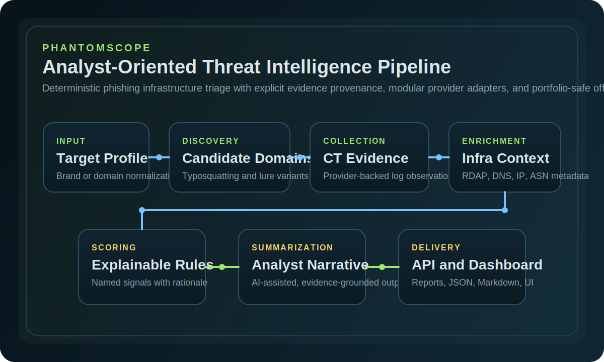
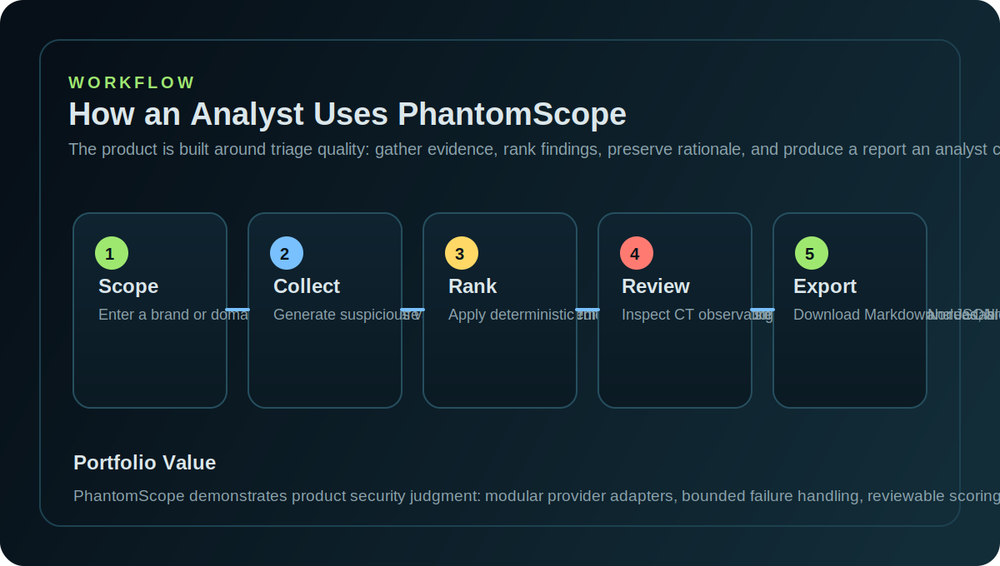

# PhantomScope

PhantomScope is an analyst-oriented defensive threat intelligence product for identifying suspicious lookalike domains and surrounding infrastructure associated with phishing, typosquatting, and brand impersonation.

It is intentionally built as a credible internal security engineering system, not a generic dashboard demo. The emphasis is on explainable triage, deterministic risk scoring, modular provider integration, and portfolio-safe execution that still looks and behaves like a real product.



## Executive Summary

Security teams dealing with brand abuse and phishing investigations usually face the same operational gap:

- suspicious domains appear before clear incident confirmation
- infrastructure evidence is fragmented across CT, DNS, RDAP, and hosting context
- prioritization often becomes manual, inconsistent, and hard to defend
- stakeholders want concise answers, while analysts need evidence and rationale

PhantomScope addresses that gap by taking a target brand or domain, generating suspicious variants, correlating external evidence, applying transparent scoring rules, and producing analyst-ready output through API, dashboard, and exportable reports.

## Why This Project Is Stronger Than a Typical Security Demo

- It models a realistic phishing infrastructure triage workflow instead of a generic SOC-style UI.
- Risk scoring is deterministic, additive, and explainable through named signals and evidence.
- AI is used only as an acceleration layer for summarization, never as the source of truth for scoring.
- Mock and live provenance are shown explicitly so the demo remains honest and reviewable.
- The architecture keeps discovery, enrichment, scoring, summarization, reporting, persistence, and UI separated cleanly.

## Core Capabilities

- Accept a target brand or domain and normalize it into an explicit target profile.
- Generate typosquatting and phishing-lure candidates designed for analyst review.
- Query Certificate Transparency observations through provider adapters.
- Enrich findings with DNS, RDAP, IP, ASN, registrar, and related infrastructure context.
- Apply deterministic risk rules that emit clear score contributions and rationale.
- Produce analyst summaries with deterministic fallback when AI is unavailable.
- Export results as Markdown and JSON for handoff, reporting, or review.
- Run through a FastAPI backend and a Streamlit dashboard with offline-safe demo support.

## Product Workflow



### End-to-End Flow

1. A user submits a brand or domain target.
2. PhantomScope generates suspicious domain candidates relevant to phishing and impersonation scenarios.
3. CT evidence and infrastructure metadata are collected through bounded provider adapters.
4. Explainable scoring rules rank suspicious assets by named signals and evidence.
5. The system renders findings in the dashboard and exports analyst-ready reports.

## Architecture

PhantomScope is organized by domain responsibility so a reviewer can quickly understand how evidence enters the system, how scores are produced, and where each concern lives.

- `api`: FastAPI application, routes, dependencies, and HTTP-facing contracts
- `services`: end-to-end orchestration of the analysis pipeline
- `models`: Pydantic schemas for requests, findings, summaries, and reports
- `discovery`: target normalization and suspicious domain generation
- `collectors`: evidence collection orchestration such as CT gathering
- `enrichment`: infrastructure and contextual enrichment services
- `providers`: external adapters, HTTP behavior, mock providers, and provider boundaries
- `scoring`: deterministic risk rules and score rationale generation
- `ai`: grounded summarization with deterministic fallback
- `reporting`: Markdown and JSON export
- `db`: SQLite-backed persistence with a clean migration path
- `app`: Streamlit dashboard for analyst review and demonstration

### Design Principles

- deterministic, reviewable security logic
- explicit provenance for `live`, `mock`, and fallback-derived evidence
- bounded retries, timeouts, and partial-failure handling for external integrations
- thin routes and presentation layers, with business logic kept in services
- defensive-only behavior suitable for public portfolio review

## Analyst Value

The project is built to answer the kinds of questions an analyst or reviewer will immediately ask:

- Why was this domain prioritized?
- Which signals contributed to the score?
- What concrete evidence supports the claim?
- Is this output reproducible without depending on unstable live providers?
- Can the same workflow be explained cleanly in an interview or architecture review?

PhantomScope is opinionated about those answers. Scoring remains explainable, evidence remains visible, and AI-generated narrative is constrained by the structured findings already collected by the system.

## Stack

- Backend: FastAPI
- Frontend: Streamlit
- Validation: Pydantic v2
- HTTP client: `httpx`
- Persistence: SQLite
- Packaging: `pyproject.toml` with `src/` layout
- Linting: `ruff`
- Testing: `pytest`
- Deployment: Render and Docker-friendly

## Quickstart

### Install

```bash
uv venv
source .venv/bin/activate
uv pip install -e ".[dev]"
```

Alternative install path:

```bash
python3 -m venv .venv
source .venv/bin/activate
pip install -r requirements-dev.txt
pip install -e .
```

Or use:

```bash
make install
```

### Configure

```bash
cp .env.example .env
```

For a stable local demo, keep offline mode enabled:

```bash
PHANTOMSCOPE_OFFLINE_MODE=true
```

### Run Locally

Start the API:

```bash
make api
```

Start the dashboard:

```bash
make dashboard
```

Launch the interview/demo helper:

```bash
make demo-interview
```

The demo flow is most stable with:

- target: `acme`
- target type: `brand`
- offline mode: `true`

## Demo Narrative

PhantomScope is designed to demo well because it tells a technically credible story quickly:

1. Enter a brand such as `acme`.
2. Show the generated candidate count and ranked findings.
3. Open the highest-priority finding and walk through the triggered risk signals.
4. Highlight CT observations, registrar and ASN context, and evidence provenance.
5. Show the narrative summary and export the Markdown report.

That sequence demonstrates product thinking, security engineering judgment, and explainable analyst tooling in under two minutes.

## Render Deployment

PhantomScope is structured for a two-service Render deployment:

- `phantomscope-api`: FastAPI backend
- `phantomscope-dashboard`: Streamlit frontend

The repository already includes the deployment blueprint in [render.yaml](/home/eduardo/projects/phantomscope/render.yaml:1).

### API Service

- Service type: `Web Service`
- Build command: `pip install -r requirements-dev.txt && pip install -e .`
- Start command: `uvicorn phantomscope.api.main:app --host 0.0.0.0 --port $PORT`
- Health check path: `/api/v1/health`

Recommended environment variables:

- `PHANTOMSCOPE_ENV=production`
- `PHANTOMSCOPE_LOG_LEVEL=INFO`
- `PHANTOMSCOPE_OFFLINE_MODE=true`
- `PHANTOMSCOPE_DATABASE_URL=sqlite:///./phantomscope.db`

### Dashboard Service

- Service type: `Web Service`
- Build command: `pip install -r requirements-dev.txt && pip install -e .`
- Start command: `streamlit run app/dashboard.py --server.port $PORT --server.address 0.0.0.0`

Required environment variables:

- `PHANTOMSCOPE_ENV=production`
- `PHANTOMSCOPE_LOG_LEVEL=INFO`
- `PHANTOMSCOPE_OFFLINE_MODE=true`
- `PHANTOMSCOPE_DASHBOARD_API_URL=https://<your-api-service>.onrender.com/api/v1/analyses`

### Deployment Notes

- Keep offline mode enabled for a stable portfolio demonstration.
- SQLite is acceptable for a demo-oriented MVP and can be replaced later.
- External integrations are isolated behind provider adapters to reduce migration churn.

## API Example

```bash
curl -X POST http://127.0.0.1:8000/api/v1/analyses \
  -H "Content-Type: application/json" \
  -d '{
    "target": "acme",
    "target_type": "brand",
    "offline_mode": true,
    "max_variants": 12
  }'
```

Useful endpoints:

- `GET /api/v1/analyses`
- `GET /api/v1/analyses/{analysis_id}`
- `GET /api/v1/health`

## Security Posture

- defensive-only workflow
- no active or abusive collection behavior
- environment-variable based secret handling
- sanitized inputs and bounded network behavior
- deterministic scoring kept separate from AI summarization
- explicit mock labeling for honest, reproducible demos

## Repository Structure

```text
phantomscope/
├── app/
│   └── dashboard.py
├── data/
│   └── mock/
├── docs/
│   ├── demo-flow.md
│   ├── portfolio-copy.md
│   ├── roadmap.md
│   └── screenshots/
├── src/
│   └── phantomscope/
│       ├── ai/
│       ├── api/
│       ├── collectors/
│       ├── core/
│       ├── db/
│       ├── discovery/
│       ├── enrichment/
│       ├── models/
│       ├── providers/
│       ├── reporting/
│       ├── scoring/
│       ├── services/
│       └── summarization/
├── tests/
├── render.yaml
└── pyproject.toml
```

## Validation

Current repository validation covers:

- schema validation and target sanitization
- deterministic scoring and score rationale
- end-to-end offline analysis flow
- API integration for create, fetch, list, and structured validation behavior

## Roadmap

### Near-Term

- provider contract tests for CT and RDAP adapters
- richer clustering across registrar, nameserver, ASN, and hosting overlap
- historical diffing and scheduled monitoring
- stronger persistence abstraction for PostgreSQL migration

### Longer-Term

- background jobs and recurring analysis
- analyst feedback loops for scoring refinement
- campaign and entity clustering
- alerting and workflow integrations
- investigation history and case management features

## Professional Positioning

PhantomScope is a strong portfolio project because it demonstrates more than framework familiarity. It shows how to model a security problem clearly, preserve explainability under pressure, separate deterministic logic from AI assistance, and ship a product that can be defended in front of a senior engineer or security reviewer.
